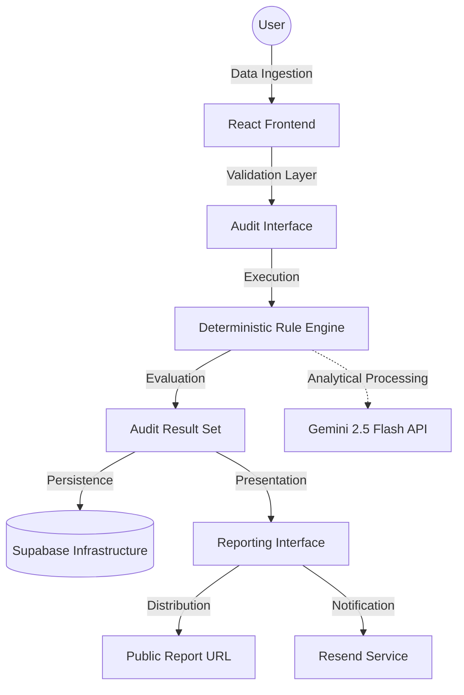

# Vyay System Architecture

This document delineates the technical architecture and data flow specifications of the Vyay platform.

## System Overview

## User Experience Workflow
1. **Landing Interface**: Initial user engagement via a value-proposition-oriented interface.
2. **Audit Interface**: A structured, multi-stage data collection process managed via React Router.
3. **Analytical Processing**: The deterministic engine evaluates inputs against standardized pricing datasets and business rules.
4. **Reporting**: Generation of a comprehensive dashboard highlighting financial leakages, identified savings, and strategic action plans.

## Data Governance and Flow
- **Input Specification**: `AuditInput` schema encompassing an array of `ToolInput` parameters.
- **Processing Logic**: Systematic evaluation to identify service redundancies (e.g., simultaneous Cursor and GitHub Copilot subscriptions) or sub-optimal service tiers.
- **Output Specification**: `AuditResult` object containing key performance indicators and a comprehensive set of `Recommendation` entities.

## Technology Rationale
- **Vite/React**: Selected for high-performance, component-based application development.
- **Supabase**: Utilized for rapid backend deployment and scalable relational data management.
- **Gemini 2.5 Flash**: Integrated for low-latency, high-performance analytical processing of spend patterns.
- **Zustand**: Implemented for efficient, non-boilerplate state management within complex interfaces.

## Authentication Strategy
Vyay is architected as a high-velocity utility. Authentication was intentionally excluded to eliminate user friction and maximize immediate service utility. Data security and sharing are managed via unique identifiers and secure public endpoints, consistent with industry-standard utility tools.

## Scalability and Performance
- **High Volume Throughput**: The audit engine is architected for client-side or edge execution to minimize server overhead. Supabase provides the necessary concurrency for high-frequency data persistence.
- **Metadata Optimization**: Dynamic Open Graph metadata is generated for each report to facilitate professional distribution across corporate communication channels.

## Audit Engine Framework
The engine architecture is divided into three primary modules:
1. **Normalization Layer**: Maps heterogeneous user inputs to standardized tool definitions.
2. **Analytical Engine**: Executes business rules to identify service overlaps and tier inefficiencies.
3. **Reporting Layer**: Synthesizes analytical outputs into structured, human-readable strategic recommendations.
