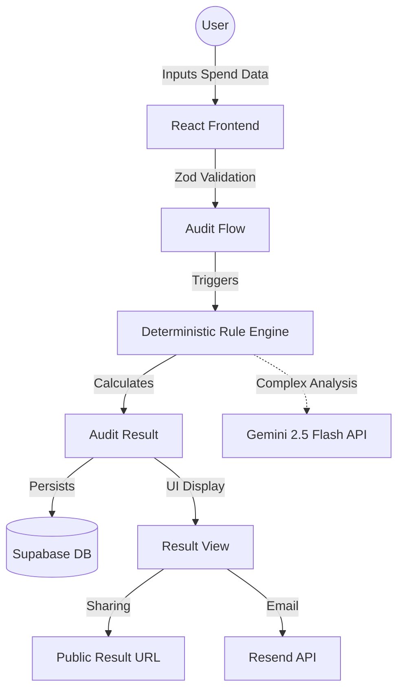

# Vyay System Architecture

This document outlines the technical design and data flow of the Vyay platform.

## 🏗 System Overview

## 🔄 User Flow
1. **Landing**: User lands on a high-conversion page explaining the value prop.
2. **Audit Flow**: A multi-step form (using `react-router` for steps) collects tool usage.
3. **Analysis**: The rule engine matches inputs against `data/pricing.ts` and `rules/*.ts`.
4. **Result**: A beautiful, shareable dashboard showing "Total Leaking", "Savings Found", and "Action Plan".

## 📊 Data Flow
- **Input**: `AuditInput` object containing an array of `ToolInput`.
- **Processing**: Rules process the array to find duplicates (e.g., Cursor + VS Code Copilot) or oversized plans (e.g., ChatGPT Enterprise for 2 people).
- **Output**: `AuditResult` containing summary metrics and a list of `Recommendation` objects.

## 🛠 Why This Stack?
- **Vite/React**: Industry standard for fast, interactive SPAs.
- **Supabase**: Rapid backend setup with built-in Auth (for future) and Postgres.
- **Gemini 2.5 Flash**: Low latency, high performance for text-based spend analysis.
- **Zustand**: Minimalist state management for multi-step forms.

## 🚫 Why No Authentication?
Vyay is a **utility tool**, not a platform. The goal is to provide value in < 60 seconds. Requiring a login adds a friction point that would drop conversion by 40-60%. We use unique IDs and public URLs for sharing, similar to tools like Ray.so or Carbon.

## 📈 Scalability Considerations
- **10k Audits/Day**: The rule engine is purely functional and client-side or Edge-based, minimizing server load. Supabase handles concurrent database writes efficiently.
- **Open Graph**: Each `/result/:id` will have dynamic OG tags for Twitter/LinkedIn sharing, optimized via Vercel Edge Functions or Supabase Meta tags.

## 🧠 Audit Engine Structure
The engine is split into:
1. **Matchers**: Map user input to known tools.
2. **Analyzers**: Identify overlaps and oversized tiers.
3. **Mappers**: Generate human-readable recommendations.
