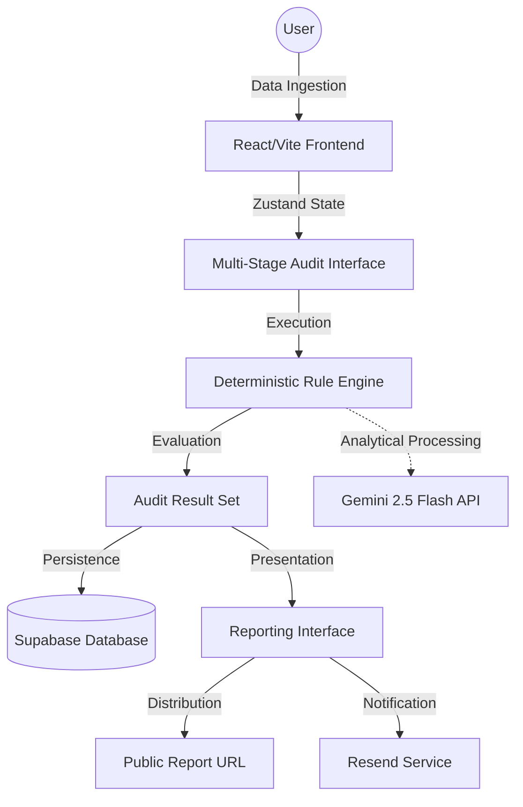

# Vyay System Architecture

This document delineates the technical architecture, data flow specifications, and scaling strategies for the Vyay platform.

## System Infrastructure Overview

## Data Flow Architecture
1. **Ingestion Phase**: User inputs tool usage data (subscriptions, seats, tiers) via a multi-stage React form. Form state is persisted locally using Zustand to prevent data loss on browser refresh.
2. **Analysis Phase**: The **Deterministic Audit Engine** processes inputs against a validated pricing dataset (`src/data/`). It executes a series of logic hooks to identify service redundancies and tier inefficiencies.
3. **AI Enhancement**: A structured summary of the audit input is transmitted to the **Gemini 2.5 Flash API** to generate a human-centric narrative of the findings.
4. **Persistence Phase**: The resulting audit object is stored in **Supabase**, generating a unique, non-guessable identifier for the public report.
5. **Distribution Phase**: The reporting interface resolves the report ID to display a high-fidelity, shareable dashboard.

## Technology Stack Justification

| Component | Technology | Rationale |
| :--- | :--- | :--- |
| **Frontend Framework** | **React 18** | Industry standard for building reactive, component-based user interfaces with extensive ecosystem support for utility tools. |
| **Build Tooling** | **Vite** | Provides near-instantaneous Hot Module Replacement (HMR) and optimized production builds, critical for maintaining high development velocity. |
| **State Management** | **Zustand** | Offers a minimalist, high-performance state store without the complexity of Redux, ideal for managing the transient state of an audit form. |
| **Validation** | **Zod** | Ensures type-safe data handling from form input to database persistence, reducing runtime errors. |
| **Backend/DB** | **Supabase** | Provides a robust, scalable PostgreSQL infrastructure with built-in row-level security and rapid API generation, minimizing DevOps overhead. |
| **AI Integration** | **Gemini 2.5 Flash** | Selected for its exceptional performance-to-cost ratio and high speed in generating analytical summaries. |

## Scaling Strategy: 10,000 Audits Per Day

To support a throughput of 10,000 audits per day (approximately 7 audits per minute with peak bursts), the following architectural optimizations are implemented:

1. **Edge-Based Execution**: The core deterministic audit logic executes entirely on the client side. This offloads the primary computational burden from the server, allowing the infrastructure to scale linearly with user traffic.
2. **Database Concurrency**: Supabase (PostgreSQL) is architectured to handle thousands of concurrent connections. For 10k audits/day, the database load remains minimal, primarily involving simple `INSERT` and `SELECT` operations.
3. **API Rate Management**: AI and Email services (Gemini and Resend) are managed via a queue-based or debounce strategy in the frontend to prevent exceeding rate limits during high-traffic bursts.
4. **Static Optimization**: The frontend is deployed via Vercel's Global Edge Network, ensuring low-latency delivery of the application shell regardless of the user's geographic location.
5. **Caching Layer**: Public audit reports are cached at the edge using Vercel's CDN headers, ensuring that repeat views of the same report do not strain the database.

## Authentication Strategy
Vyay is designed as a high-utility lead-generation asset. Traditional authentication was intentionally bypassed to eliminate entry barriers. Data integrity and privacy are maintained through unique, UUID-based report URLs and strict data-stripping protocols for public views.
