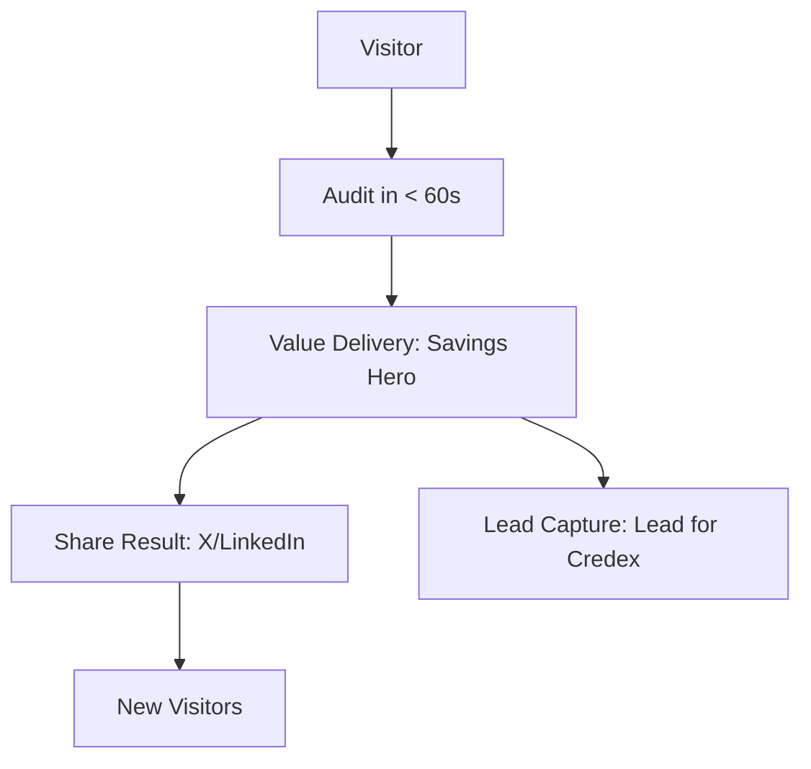

# Vyay Go-To-Market (GTM) Strategy

Vyay is not just a tool; it's a "Proof of Authority" for the modern AI engineer. Our GTM focuses on high-density engineering clusters and radical transparency.

## 1. Primary Channels

### A. The "Screenshot Economy" (X/Twitter)
- **Mechanism**: The "Result Hero" section is designed specifically to be screenshotted and shared.
- **Hook**: Engineers love "Efficiency Bragging" (Grade A) or "Waste Shaming" (Grade F).
- **Target**: Founders, CTOs, and Head of Platforms.

### B. Product Hunt & Hacker News
- **Mechanism**: Launch as a free, "No Auth Required" utility.
- **Value**: Radical time-to-value (Audit in < 60 seconds).
- **Goal**: High volume top-of-funnel (ToF) traffic.

### C. The "Embeddable Trust" Widget
- **Mechanism**: Free widget for engineering blogs and startup resource sites.
- **Value**: Drives high-intent traffic back to the full audit engine.

## 2. Viral Loop Mechanics

## 3. Launch Timeline (7 Days)

| Day | Action | Goal |
| :--- | :--- | :--- |
| 1 | Soft Launch to User Interviewees | Feedback & Bug Bash |
| 2 | "Efficiency Brag" Campaign on X | Early Viral Traction |
| 3 | Product Hunt Launch | Volume Traffic |
| 4 | Hacker News Show HN | Technical Deep-dive discussion |
| 5 | LinkedIn "State of AI Spend" Report | Strategic/CTO engagement |
| 6 | Widget Distribution | Long-tail SEO/Traffic |
| 7 | Lead Nurturing Start | Conversion to Credex Consultation |

---
"Speed to value is the only moat."
