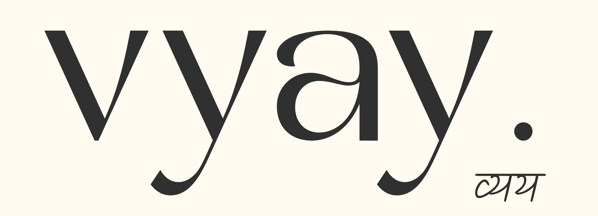

# Audit Engine Reference: Vendor Pricing & Tiers

This document serves as the "Source of Truth" for the deterministic audit engine. All logic hooks are calculated against these validated pricing benchmarks.

> [!IMPORTANT]
> **AI tool pricing is subject to frequent updates and regional variations. Values shown are based on official documentation at the time of verification. Pricing may change.**

## 1. Coding Assistants (IDE & Extensions)

| Tool | Tier | Price (seat/mo) | Official Source | Verified |
| :--- | :--- | :--- | :--- | :--- |
| **Cursor** | Hobby | $0 | [cursor.com/pricing](https://cursor.com/pricing) | 2026-05-12 |
| | Pro | $20 | [cursor.com/pricing](https://cursor.com/pricing) | 2026-05-12 |
| | Business | $40 | [cursor.com/pricing](https://cursor.com/pricing) | 2026-05-12 |
| **GitHub Copilot** | Free | $0 | [github.com/features/copilot](https://github.com/features/copilot) | 2026-05-12 |
| | Individual | $10 | [github.com/features/copilot](https://github.com/features/copilot) | 2026-05-12 |
| | Business | $19 | [github.com/features/copilot](https://github.com/features/copilot) | 2026-05-12 |
| | Enterprise | $39 | [github.com/features/copilot](https://github.com/features/copilot) | 2026-05-12 |
| **Windsurf** | Free | $0 | [windsurf.com/pricing](https://windsurf.com/pricing) | 2026-05-12 |
| | Pro | $15 | [windsurf.com/pricing](https://windsurf.com/pricing) | 2026-05-12 |
| | Teams | $30 | [windsurf.com/pricing](https://windsurf.com/pricing) | 2026-05-12 |

## 2. General Purpose Reasoning (Chat)

| Tool | Tier | Price (seat/mo) | Official Source | Verified |
| :--- | :--- | :--- | :--- | :--- |
| **ChatGPT** | Free | $0 | [chatgpt.com/pricing](https://chatgpt.com/pricing) | 2026-05-12 |
| | Plus | $20 | [chatgpt.com/pricing](https://chatgpt.com/pricing) | 2026-05-12 |
| | Pro | $200 | [chatgpt.com/pricing](https://chatgpt.com/pricing) | 2026-05-12 |
| | Team | $30 | [chatgpt.com/pricing](https://chatgpt.com/pricing) | 2026-05-12 |
| **Claude** | Free | $0 | [claude.ai/pricing](https://claude.ai/pricing) | 2026-05-12 |
| | Pro | $20 | [claude.ai/pricing](https://claude.ai/pricing) | 2026-05-12 |
| | Max 5x | $100 | [claude.ai/pricing](https://claude.ai/pricing) | 2026-05-12 |
| | Max 20x | $200 | [claude.ai/pricing](https://claude.ai/pricing) | 2026-05-12 |
| | Team | $25 | [claude.ai/pricing](https://claude.ai/pricing) | 2026-05-12 |
| **Gemini** | Free | $0 | [gemini.google/subscriptions](https://gemini.google/subscriptions) | 2026-05-12 |
| | Advanced | $20 | [gemini.google/subscriptions](https://gemini.google/subscriptions) | 2026-05-12 |
| | Ultra | $250 | [gemini.google/subscriptions](https://gemini.google/subscriptions) | 2026-05-12 |

## 3. API Providers (Usage-Based)

| Provider | Model Examples | Input/Output Units | Official Source | Verified |
| :--- | :--- | :--- | :--- | :--- |
| **OpenAI API** | GPT-5.5, GPT-5.3 Mini | Per 1M Tokens | [openai.com/api/pricing](https://openai.com/api/pricing) | 2026-05-12 |
| **Anthropic API** | Claude Sonnet, Opus | Per 1M Tokens | [anthropic.com/pricing](https://www.anthropic.com/pricing) | 2026-05-12 |

## 4. Deterministic Audit Rules

- **Redundancy Analysis**: We flag overlapping tools in the same category (e.g., using both Cursor and Copilot).
- **Tier Efficiency**: If `teamSize < 5` AND `tier === 'team'`, we suggest a downgrade.
- **Enterprise Oversight**: For teams `< 20`, Enterprise tiers are often flagged as potential administrative overspend.
- **API Substitution**: High-volume chat usage is compared against API-based alternatives for potential capital recovery.

---
"Calculated intelligence, verified data."
