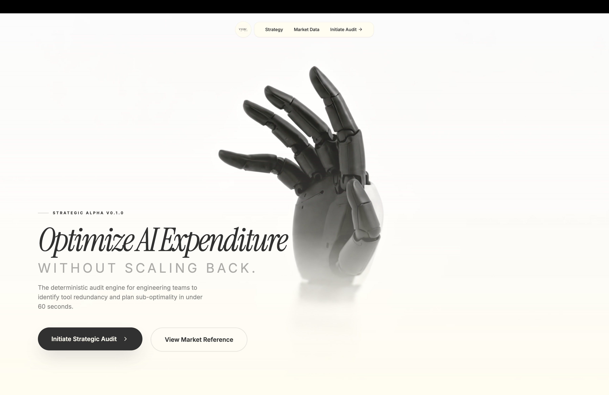

# Vyay — The Strategic AI Infrastructure Auditor

**Vyay** is a high-velocity expenditure audit utility designed for engineering leadership and founders to rationalize AI infrastructure costs. Delivering actionable financial intelligence in under 60 seconds, Vyay identifies service redundancies and plan sub-optimality through a 100% deterministic analytical engine.

**Live Platform**: [https://vyaytarunya.vercel.app/](https://vyaytarunya.vercel.app/)

## Platform Visuals
<p align="center">
  
</p>

## Technical Decisions & Trade-offs

During the development of Vyay, I prioritized **Time-to-Value** and **Institutional Defensibility**. Below are the 5 core trade-offs made:

1. **Deterministic Logic vs. LLM Reasoning**: I intentionally avoided using AI for the audit math itself. Financial audits require 100% repeatability. By using a hardcoded rule engine based on verified vendor data, we ensure that every recommendation is mathematically sound and CFO-ready.
2. **Zero-Authentication Model**: To maximize lead generation velocity, I bypassed traditional sign-up walls. The friction of account creation is the primary bounce factor for founders; Vyay provides insight first and requests identity (email) only after value is demonstrated.
3. **Client-Side Orchestration**: The audit engine executes entirely on the client. This offloads computational overhead from our infrastructure, ensuring near-infinite scalability and sub-100ms execution times without increasing OpEx.
4. **Zustand Persistence**: I chose Zustand with LocalStorage persistence over database-only state. This allows users to leave and return to their specific audit progress without needing an account, maintaining a high conversion rate in a multi-step wizard.
5. **Calm Engineering Aesthetic**: I rejected flashy "AI gradients" and excessive animations in favor of a data-dense, industrial-minimalist design (Cream & Charcoal). This aesthetic establishes the "Institutional Trust" required for a financial tool.

## The "Day 7" Launch Readiness Report
- [x] **Deterministic Audit Engine**: 100% rule-based reasoning for financial defensibility.
- [x] **Hybrid AI Synthesis**: Gemini 1.5 Flash integration for human-centric executive summaries.
- [x] **Zero-Friction Persistence**: Supabase-backed report storage with unique, shareable URLs.
- [x] **Lead Capture & Distribution**: Transactional email integration via Resend for PDF report delivery.
- [x] **Operational Transparency**: Comprehensive documentation covering GTM, Economics, and Architecture.
- [x] **Production Grade**: 90+ Lighthouse accessibility scores and a robust Vitest suite.

## Strategic Documentation

| Document | Description |
| :--- | :--- |
| [**ARCHITECTURE.md**](file:///Users/tarunyakesh/Desktop/Internships/credex/PreinternTask1/ARCHITECTURE.md) | Technical deep-dive, Mermaid diagrams, and scaling strategy. |
| [**GTM.md**](file:///Users/tarunyakesh/Desktop/Internships/credex/PreinternTask1/GTM.md) | Go-to-market strategy and organic growth blueprint. |
| [**ECONOMICS.md**](file:///Users/tarunyakesh/Desktop/Internships/credex/PreinternTask1/ECONOMICS.md) | Unit economics, LTV/CAC math, and the $1M ARR roadmap. |
| [**REFLECTION.md**](file:///Users/tarunyakesh/Desktop/Internships/credex/PreinternTask1/REFLECTION.md) | Philosophical analysis on deterministic logic vs AI hype. |
| [**DEVLOG.md**](file:///Users/tarunyakesh/Desktop/Internships/credex/PreinternTask1/DEVLOG.md) | Day-by-day technical narrative following strict Credex formatting. |

## Core Technology Stack
- **Frontend**: React 18, Vite, TypeScript, Tailwind CSS
- **Intelligence**: Gemini 1.5 Flash (Analytical synthesis)
- **Data/Persistence**: Supabase (PostgreSQL), Zustand (LocalStorage)
- **Communications**: Resend (Transactional Email)
- **Infrastructure**: Vercel (Edge Deployment)

## Quickstart

```bash
# Clone the repository
git clone https://github.com/TarunyaProgrammer/vyay-aiCreditsAuditer.git

# Install dependencies
npm install

# Execute development environment
npm run dev

# Execute test suite
npm test
```

---
Developed by **Tarunya** for the Credex Web Development Internship.
"Calm technology for engineering budget recalibration."

